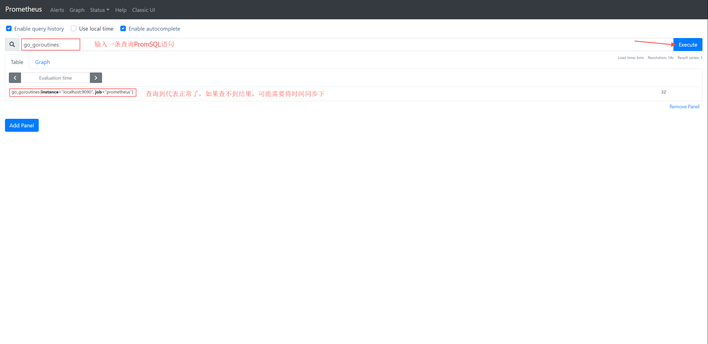

# Prometheus Install and Deploy
[官方下载地址](https://prometheus.io/download/)

> 建议将此工具链放到/opt目录下,root权限执行即可,以下命令默认在/opt目录下安装部署

## Linux 安装
~~~bash
# Download
$ cd /opt/ && wget https://github.com/Joker1222/Personal-Server-Monitor/raw/master/prometheus/prometheus-2.23.0-linux-amd64.tgz

# Decompression and change dirname
$ cd /opt && tar -zxvf prometheus-2.23.0-linux-amd64.tgz && mv prometheus-2.23.0-linux-amd64 prometheus
~~~

## 一键启动
~~~bash
# run.sh 这里自己封装了一套启停服务脚本,以及守护进程脚本。
# param list: 
#             - start   以守护进程的方式启动,启动守护进程,通过守护进程启动prometheus,日志输出在./log/目录下
#             - stop    终止守护进程、终止prometheus进程
#             - status  查看prometheus进程状态
#             - restart 如果守护进程不存在,则启动守护进程,如果守护进程存在则直接关掉prometheus进程,等待5s后prometheus被守护进程自动拉起
$ cd /opt/prometheus/ && ./run.sh start 

# ps: 默认配置无任何探针(exporter)
~~~

## 配置探针IP端口 简易说明
~~~bash
$ vim /opt/prometheus/prometheus.yml
# my global config
global:
  scrape_interval:     15s # Set the scrape interval to every 15 seconds. Default is every 1 minute.
  evaluation_interval: 15s # Evaluate rules every 15 seconds. The default is every 1 minute.
  # scrape_timeout is set to the global default (10s).

# Alertmanager configuration
alerting:
  alertmanagers:
  - static_configs:
    - targets:
      # - alertmanager:9093

# Load rules once and periodically evaluate them according to the global 'evaluation_interval'.
rule_files:
  # - "first_rules.yml"
  # - "second_rules.yml"

# A scrape configuration containing exactly one endpoint to scrape:
# Here it's Prometheus itself.
scrape_configs:
  # The job name is added as a label `job=<job_name>` to any timeseries scraped from this config.
  - job_name: 'prometheus'   # 主要是以下三行,如果启动了exporter就把相应的地址配置进去
    static_configs:
      - targets: ['localhost:9090']
      
  # 这里举两个例子
  - job_name: 'node_exporter'   # node_exporter是部署在被监控服务机器上的,填写被监控机器的IP端口(9100)
    static_configs:
      - targets: ['ServerIP:9100'] #node_exporter端口默认为9100
     
  - job_name: 'process_exporter'   # process_exporter是部署在被监控服务机器上的,填写被监控机器的IP端口(9256)
    static_configs:
      - targets: ['ServerIP:9256']
$ cd /opt/prometheus/ && ./run.sh restart # 保存后重启prometheus即可生效.
~~~

# 打开浏览器验证  

http://IP:9090/ **默认端口9090**  

