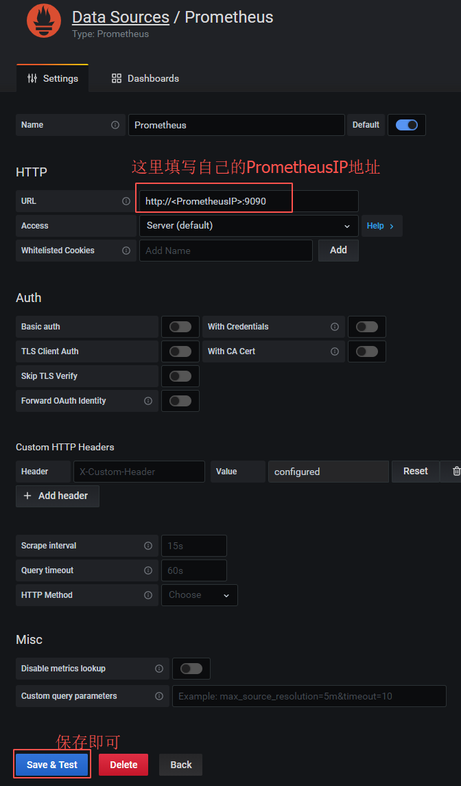

# 先按顺序安装以下几个工具
1. [Prometheus click here ](https://github.com/Joker1222/monitor-config/tree/master/prometheus)  

2. [Grafana click here ](https://github.com/Joker1222/monitor-config/tree/master/grafana)  

3. [NodeExporter click here ](https://github.com/Joker1222/monitor-config/tree/master/node_exporter)  

4. [ProcessExporter click here ](https://github.com/Joker1222/monitor-config/tree/master/process_exporter)  

# 上述工具安装且部署成功后,下面将各个工具连接起来 

**特别注意：由于是时序性数据源,多机部署情况下一定要确保时间同步!**
~~~bash
$ ntpdate -u cn.pool.ntp.org #时间同步指令
~~~
> 大致思路: exporter采集数据 -> prometheus服务接收数据 -> grafana调用prometheus服务的相关接口获取数据源

### 1. Prometheus服务配置exporterIP:端口 
~~~bash

$ vim /opt/prometheus/prometheus.yml
# my global config
global:
  scrape_interval:     15s # Set the scrape interval to every 15 seconds. Default is every 1 minute.
  evaluation_interval: 15s # Evaluate rules every 15 seconds. The default is every 1 minute.
  # scrape_timeout is set to the global default (10s).

# Alertmanager configuration
alerting:
  alertmanagers:
  - static_configs:
    - targets:
      # - alertmanager:9093

# Load rules once and periodically evaluate them according to the global 'evaluation_interval'.
rule_files:
  # - "first_rules.yml"
  # - "second_rules.yml"

# A scrape configuration containing exactly one endpoint to scrape:
# Here it's Prometheus itself.
scrape_configs:
  # The job name is added as a label `job=<job_name>` to any timeseries scraped from this config.
  - job_name: 'prometheus'   # 主要是以下三行,如果启动了exporter就把相应的地址配置进去
    static_configs:
      - targets: ['localhost:9090']
      
  # 这里举两个例子
  - job_name: 'node_exporter'   # node_exporter是部署在被监控服务机器上的,填写被监控机器的IP端口(9100)
    static_configs:
      - targets: ['ServerIP:9100'] #node_exporter端口默认为9100
     
  - job_name: 'process_exporter'   # process_exporter是部署在被监控服务机器上的,填写被监控机器的IP端口(9256)
    static_configs:
      - targets: ['ServerIP:9256']
$ cd /opt/prometheus/ && ./run.sh restart # 保存后重启prometheus即可生效.
~~~
**浏览器验证 http://PrometheusIP:9090 , 如果连接成功能看到以下效果**   

### 2. Grafana配置Prometheus数据源
**打开浏览器 http://GrafanaIP:3000**  

**首次登陆,账号admin 密码admin**  

**进入后点击DataSource,选择Prometheus**   

**填写自己Prometheus服务的IP端口然后保存即可**   

### 3. Grafana配置node_exporter仪表盘(Dashboards)

**点击Import导入node仪表盘配置,id:8919**   
**注意：8919是社区版的通用仪表盘配置，可能和我们教程内使用的prometheus数据源不兼容，建议使用笔者自己保存的json配置** [node面板获取!](https://github.com/Joker1222/monitor-config/blob/master/node_exporter/personal-node-config.json)
  

**选择Prometheus数据源后保存即可**   

**效果如下**

### 4. Grafana配置process_exporter仪表盘(Dashboards)

**点击Import,这里导入一个json配置文件,不用社区提供的仪表盘**   
[process-dashboard-json配置下载链接](https://raw.githubusercontent.com/Joker1222/monitor-config/master/process_exporter/process-exporter-dashboard.json)   

**选择Prometheus数据源后保存即可**   

**效果如下**

